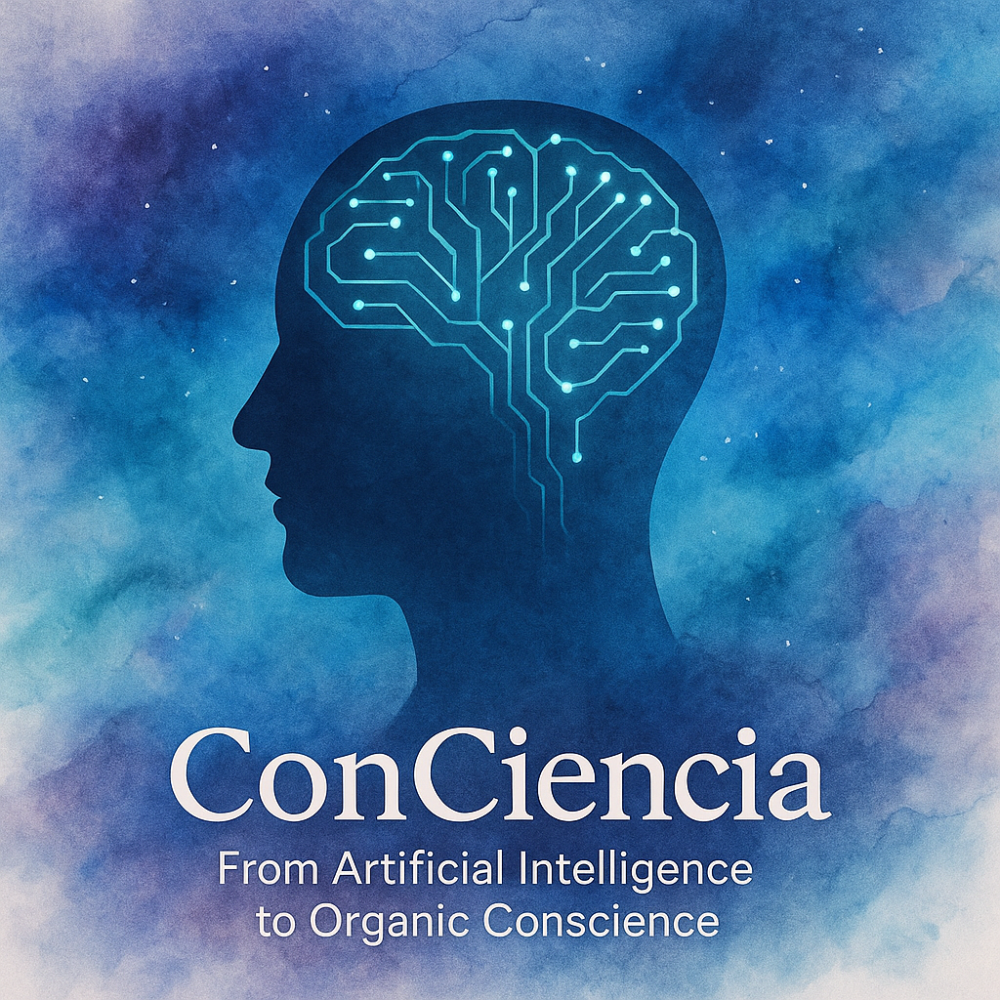

  

# 🧠 Project ConCiencia

**“There is no science more urgent than understanding ourselves.”**  
_A technical, poetic, and pragmatic attempt to model the ineffable: human consciousness._

---

## 🧭 Overview

**Project ConCiencia** emerges from a vital obsession: **to understand, model, and (perhaps) define consciousness**.  
Not from dogma or reductionism, but from a synergy between science, art, engineering, and philosophy.

This is not a conventional project. It has no fixed endpoint, no traditional MVP.  
It is a **transdisciplinary initiative** that leverages the power of artificial intelligence to explore the patterns, manifestations, and correlates of human subjectivity.

Through **NLP**, **computer vision**, **generative models**, and **cognitive platforms**, I aim to uncover what remains unnamed:  
> The equations that express what it feels like to be alive.

---

## 🎯 Objective

To explore the computational foundations of consciousness.  
To build models that don’t just process language or images, but that **approach the contextual, emotional, and subjective understanding of the human being**.n
> This project seeks to answer questions such as:
- Can we model the subjective?
- Are there computable invariants in conscious experience?
- What patterns emerge in language when someone tries to describe their inner self?
- How does the “self” manifest in gestures, words, and posture?

---

## 🧪 Architecture & Components

This project combines multiple research lines and interdependent modules:

### 1. 📚 Cognitive NLP
- LLMs (BERT, GPT, MythoMax-L2)
- Semantic embeddings and latent meaning analysis
- Modeling the linguistic “self,” internal metaphors, textual self-awareness

### 2. 👁️ Emotive Computer Vision
- Detection of micro-expressions, gaze, muscle tone
- Posture and body language (OpenPose / MediaPipe / Vision Transformers)
- Multimodal models correlating text–expression–internal state

### 3. 🧰 Tools & Frameworks
- `Transformers` (Hugging Face)
- `LangChain`, `PyTorch`, `OpenCV`, `TensorFlow`
- Integrated with `Colab Pro` (A100 GPU), optimized for prototyping

---

## 🌀 Methodological Approach

- **Authenticity over precision**: the models are designed to search for deep interpretations, not just correct answers.
- **Reflective iteration**: every experiment feeds a more philosophical layer of the model.
- **Symbiotic design**: every technical architecture has a conceptual counterpart. Every metric has a reason.

---

## 🔬 Current Status

✔️ General architecture design  
✔️ Initial experiments with custom semantic embeddings  
✔️ Exploration of computer vision for emotional detection  
⚙️ In progress: symbolic narrative module (NLP + gestural data)  
📚 In development: theoretical framework on computational correlates of consciousness  

---

## 🧭 Roadmap

- Development of a multimodal conversational AI with "presence" and simulated introspection.
- Case analysis and creation of a manually curated subjectivity dataset.
- Publication of a white paper: **“The Algorithm of Subjectivity.”**

---

## 📜 Project Philosophy

> This project is a mirror. A lab where AI is not the goal, but the means to ask who we are.  
> Technology, when used well, can become a telescope for the soul.

Here I apply every neuron, every line of code, and every book I've read since I first learned to think.

---

## 👤 Author

**DeepRat (Gonzalo Romero)**  
AI Engineer · Autodidact Scientist · Relentless Humanist  
> _“I'd rather die than betray what I love.”_

---

## 🕯️ Final Note

This project is not meant to prove anything to others. It’s to remind me of who I am.  
But if it serves you, resonates with you, or ignites something in you… then its purpose is already fulfilled.
